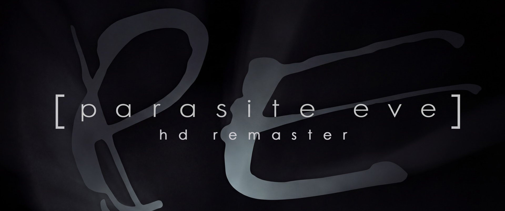
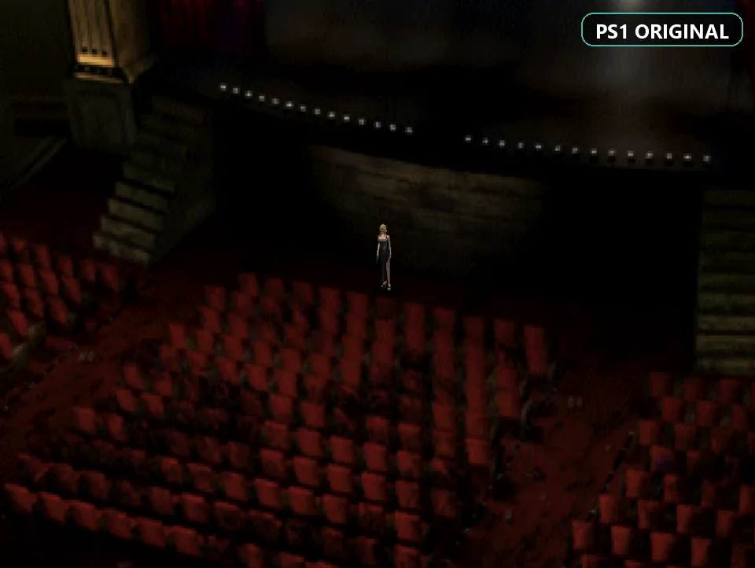
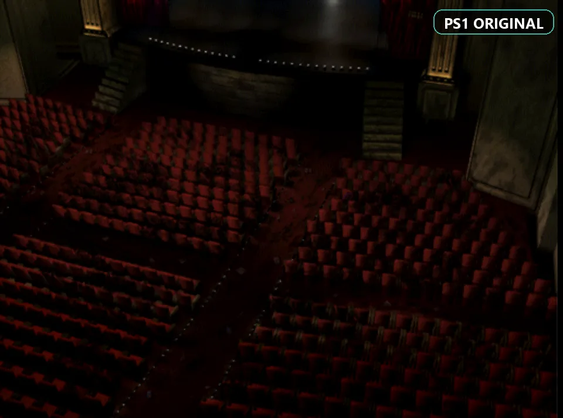
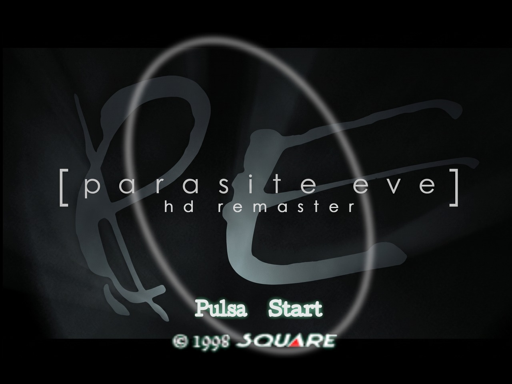
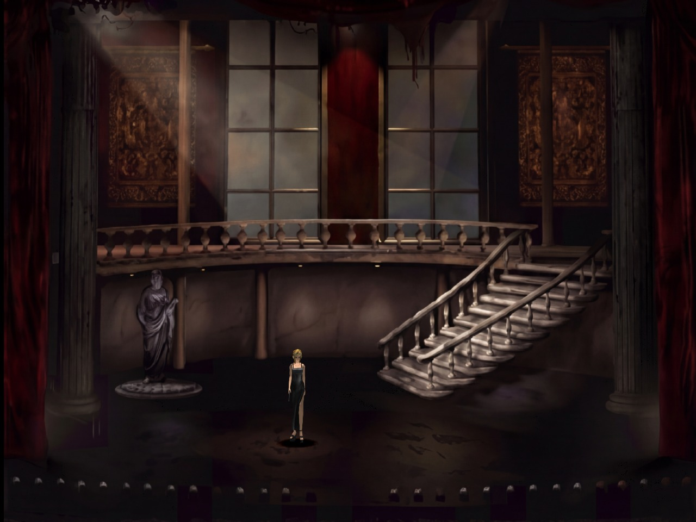
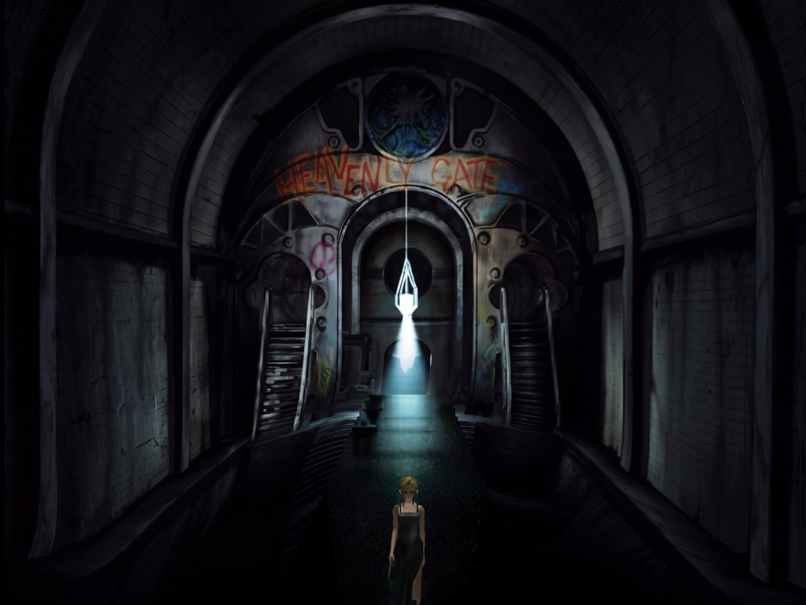
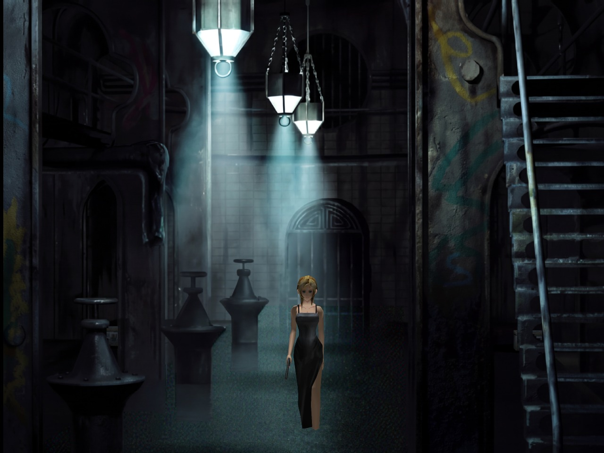
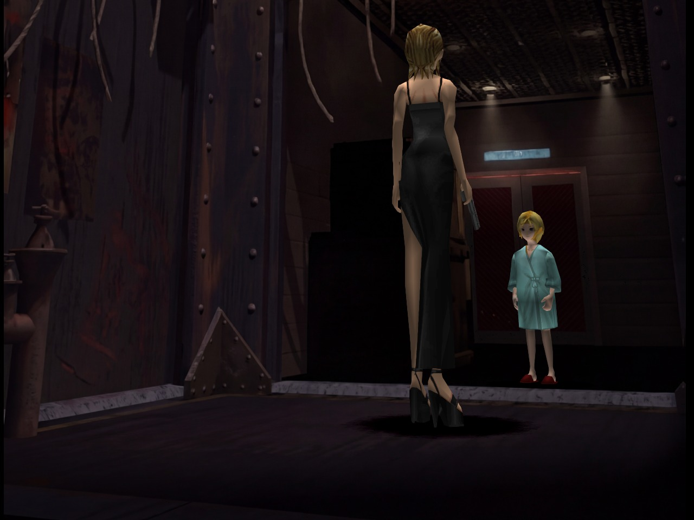
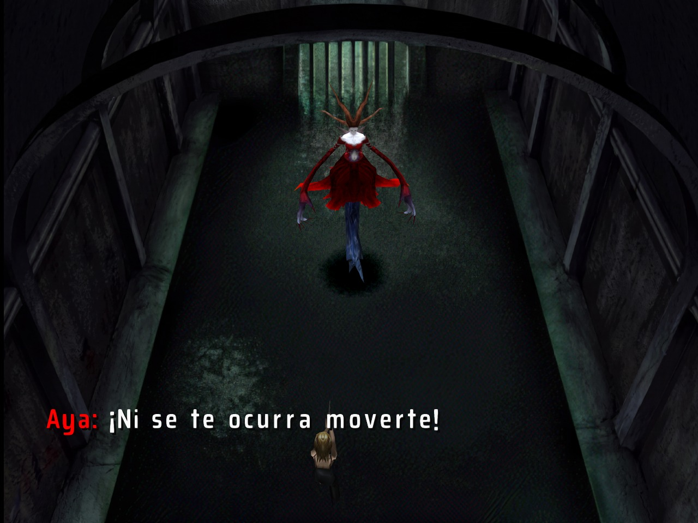

  

  <b>Una versión nativa para PC de Parasite Eve, reconstruida a partir del juego original de PlayStation y remasterizada en alta definición.</b>

  
  
  

  <a href="README.md">🇬🇧 Read in English</a>

---

## Sobre el proyecto

**Parasite Eve HD Remaster** trae el RPG de terror de Square de 1998 a los PC actuales. Es el proyecto hermano de
[Parasite Eve II HD Remaster](https://github.com/faligame/Parasite-Eve-2-HD-Remaster).

**No es un emulador.** El código original del juego de PlayStation se ha recompilado estáticamente en un ejecutable
nativo de Windows, lo que permite mejorar el juego desde dentro: modelos 3D nítidos, geometría estable y fondos
prerrenderizados reconstruidos en alta resolución.

Este repositorio es la **casa pública del proyecto**: novedades, capturas y progreso. No contiene código fuente,
ejecutables ni datos del juego.

> ⭐ Dale una **estrella** y pulsa 👁️ **Watch** para seguir el desarrollo.

---

## Prueba de concepto: el primer fondo HD

El patio de butacas del Carnegie Hall, la sala donde empieza todo, es el primer fondo remasterizado. Es la **cámara
completa**, más grande que la pantalla (517×384 píxeles en el original, recorridos con desplazamiento de cámara):
reconstruida desde los datos del juego, reescalada entera con IA a 4653×3456 y devuelta pieza a pieza al juego.

<table>
  <tr>
    <td align="center" width="50%"> <b>En el juego</b></td>
    <td align="center" width="50%"> <b>Fondo completo de la cámara</b></td>
  </tr>
</table>

   
  <b>Detalle del escenario: original (izquierda) y HD (derecha)</b>

---

## Galería

<table>
  <tr>
    <td width="50%"> <b>Pantalla de título, redibujada en HD</b></td>
    <td width="50%"> <b>Vestíbulo del Carnegie Hall</b></td>
  </tr>
  <tr>
    <td width="50%"> <b>Alcantarillas: fondo HD con su agua animada</b></td>
    <td width="50%"> <b>Bastidores, con el primer plano que tapa a Aya</b></td>
  </tr>
  <tr>
    <td width="50%"> <b>Personajes con sus texturas HD</b></td>
    <td width="50%"> <b>Fuente HD (aquí con la traducción al castellano de la comunidad)</b></td>
  </tr>
</table>

---

## Características

### 🖥️ Versión nativa para PC
- **Recompilación estática** de la edición americana (los dos discos) en un ejecutable nativo de Windows. Sin emulador.
- **Arranca con OpenBIOS**, una BIOS libre: no hace falta la BIOS de Sony.
- **Renderizado a alta resolución interna** para modelos 3D nítidos.
- **Precisión de geometría PGXP**: se acabaron los polígonos que tiemblan y las texturas que se deforman.
- **Recorte de polígonos preciso**: la PlayStation decide qué caras se ven con coordenadas enteras y, de lejos, Aya
  perdía triángulos. Ahora esa decisión se toma con precisión subpíxel y los personajes lejanos se ven completos.

### 🎨 Remasterización HD
- **Motor de texturas HD con los nombres del propio disco.** Cada imagen se reconoce al subir a la memoria de vídeo y
  se sustituye por su versión HD, que se llama como la entrada del juego (`m005_2_04.png` = sala 5, sección 2,
  imagen 4), en lugar de un código ilegible.
- **Fondos completos reconstruidos desde el disco.** En Parasite Eve los fondos no son una imagen: el juego los compone
  en pantalla con cientos de piezas de 16×16 y la cámara se desplaza por ellos, así que cada cámara tiene su propio
  tamaño (el patio de butacas del Carnegie Hall mide 517×384). El proyecto lee de los datos del juego la lista de
  piezas de cada sala y cámara y reconstruye el **fondo completo**, más grande que la pantalla, sin necesidad de jugar.
- **Reescalado del fondo entero, no de las piezas.** El fondo completo se remasteriza de una vez, con todo su contexto,
  y una herramienta devuelve cada pieza HD a su sitio exacto (comprobado píxel a píxel). No hay costuras entre piezas.
- **Primer plano incluido.** Los marcos de puerta, columnas y butacas que tapan a Aya salen de las mismas piezas del
  fondo, así que también pasan a HD y siguen tapándola igual.
- **Elementos animados de los fondos.** El agua, las luces y las puertas no forman parte del fondo fijo: el juego las
  pinta encima, fotograma a fotograma, con las mismas piezas. Cada fotograma de cada animación se reconstruye desde el
  disco y se remasteriza, así que el movimiento también queda en HD.
- **Personajes, enemigos y objetos.** Cada textura de modelo se lee directamente del disco, con los colores y la
  profundidad reales con que la dibuja el juego, y se remasteriza: Aya y sus trajes, la gente con la que se cruza y
  las criaturas con las que pelea.
- **Efectos de combate, por paleta.** El ácido, los rayos y las descargas de Parasite Energy son hojas de 16 colores
  que el juego recolorea al dibujarlas, así que una sola imagen HD no bastaba. Cada hoja se remasteriza una vez por
  paleta y el juego elige la que toca mientras juegas.
- **Los fundidos de paleta se respetan.** Cuando el juego funde la sala a gris al empezar un combate lo hace cambiando
  las paletas. Ahora las texturas HD siguen ese fundido en vez de quedarse con su color.
- **El mapa de Nueva York**, con las texturas de sus edificios y los nombres de los lugares, también remasterizado.

### 🔤 Textos e idiomas
- **Fuente de diálogos HD.** Las letras de 12×12 píxeles se sustituyen por una tipografía real dibujada a ocho veces
  su tamaño, con la sombra propia del juego y sus nombres de color.
- **Compatible con la traducción al castellano de la comunidad**, con sus acentos y sus letras añadidas, y la fuente
  HD las cubre todas.
- **Textos editables.** Todas las frases del juego (diálogos, menús, nombres de objetos) se pueden exportar, editar en
  una hoja de cálculo y volver a meter, sin tocar el disco.
- **Pantalla de título HD.** El logotipo, el menú y su resplandor se reconstruyen en alta resolución, en inglés y en
  castellano.

### ✨ Comodidades
- **Hasta 8x de resolución interna** (y antialiasing FXAA) para bordes limpios en los modelos 3D.
- **Arranque rápido**: el aviso legal y las cargas previas ya no te hacen esperar.
- **Avance rápido** manteniendo L2 en el mando, con un aviso en pantalla.
- **Trucos opcionales** de HP infinito, Parasite Energy infinita, Bonus Points al máximo y EXP x4, cada uno con su
  atajo en el mando.

### 🛠️ Herramientas
- **Pensado para quien hace texturas**: volcado automático de cada textura con sus colores reales, captura de la
  cámara actual con una tecla, recarga del pack con el juego abierto y una tecla para comparar al momento con el
  original.

---

## Hoja de ruta

| Estado | Característica |
|:---:|---|
| ✅ | Ejecutable nativo de Windows (recompilación estática, edición americana, dos discos) |
| ✅ | Arranque con OpenBIOS (sin BIOS de Sony) |
| ✅ | Renderizado a alta resolución y precisión de geometría PGXP |
| ✅ | Recorte de polígonos preciso (personajes lejanos completos) |
| ✅ | Herramientas de desarrollo: panel en pantalla, pausa por fotogramas, trazas y volcados |
| ✅ | Motor de reemplazo de texturas HD con los nombres del disco |
| ✅ | Reconstrucción de los fondos completos de cada sala y cámara desde el disco |
| ✅ | Reescalado del fondo completo y reparto automático de sus piezas, primer plano incluido |
| ✅ | Primer fondo HD: patio de butacas del Carnegie Hall |
| ✅ | Elementos animados de los fondos (agua, luces, puertas) |
| ✅ | Pack de fondos HD completo (todas las salas y cámaras) |
| ✅ | Personajes, enemigos y objetos remasterizados |
| ✅ | Efectos de combate remasterizados (una versión por paleta) y mapa de Nueva York |
| ✅ | Fuente de diálogos HD, textos editables y compatibilidad con la traducción al castellano de la comunidad |
| ✅ | Pantalla de título HD |
| ✅ | Arranque rápido, avance rápido y trucos opcionales |
| 🚧 | Interfaz de combate y menús en HD |
| 🔜 | Cinemáticas en alta resolución |
| 🔜 | Panorámico 16:9, 60 FPS, cargas rápidas y disco único (como en Parasite Eve II HD Remaster) |
| 🔜 | Instalador que construye el juego desde tus propios discos, para no distribuir nunca datos del juego |
| 🔜 | Lanzamiento público |

---

## Novedades

**23-09-2026 — Todo el juego en HD: animaciones, personajes, efectos y texto**
- **El pack de fondos HD está completo**: todas las cámaras de todas las salas, 2835 de las 2836 imágenes de fondo del
  disco.
- **Con los elementos animados**: 2296 fotogramas de animación (agua, luces, puertas) reconstruidos desde el disco,
  remasterizados y devueltos pieza a pieza.
- **Personajes, enemigos y objetos remasterizados**: 257 texturas de modelos leídas del disco con sus colores reales.
- **Efectos de combate y mapa de Nueva York**: 698 sprites, remasterizados con una versión por paleta para que el juego
  siga recoloreándolos como siempre.
- **Texto en HD**: una tipografía real para los diálogos a ocho veces el tamaño original, compatibilidad con la
  traducción al castellano de la comunidad con todos sus acentos, y la pantalla de título reconstruida en HD.
- **Más cómodo de jugar**: hasta 8x de resolución interna, FXAA, arranque rápido, avance rápido con L2 y trucos
  opcionales.

**21-09-2026 — Arranca el proyecto y primer fondo HD**
- **El juego funciona como ejecutable nativo**: la edición americana (los dos discos) se recompila y ya se puede jugar
  sin emulador, arrancando con una BIOS libre.
- **Personajes lejanos completos**: el recorte de polígonos preciso que se hizo para Parasite Eve II llega también
  aquí, donde era aún más necesario.
- **Fondos reconstruidos desde el disco**: cada cámara de cada sala se compone con su tamaño real a partir de los datos
  del juego, se reescala entera y cada pieza vuelve a su sitio. El primero es el **patio de butacas del Carnegie Hall**.
- **Herramientas para el pack HD**: identificación de cada textura con su nombre del disco, volcado con sus colores
  reales, captura de cámara, recarga en caliente y comparación con el original pulsando una tecla.

---

## Preguntas frecuentes

**¿Se puede descargar?**
Todavía no. El proyecto está en desarrollo activo. Sigue este repositorio para enterarte del primer lanzamiento.

**¿Necesitaré el juego original?**
Sí. Necesitarás tu propia copia legal de *Parasite Eve* para PlayStation (edición americana). Nunca se distribuirán
datos del juego.

**¿Es un emulador?**
No. El código del juego se ejecuta de forma nativa en tu PC tras recompilarse a partir del ejecutable original de
PlayStation.

**¿Está disponible el código fuente?**
Por ahora no.

---

## Créditos

| Proyecto | Autor | Para qué se usa | Licencia |
|---|---|---|---|
| [PSXRecomp](https://github.com/mstan/psxrecomp) | Matthew Stan | El recompilador estático de PlayStation y el runtime fiel al hardware sobre el que se construye esta versión | PolyForm Noncommercial 1.0.0 |
| [Descompilación de Parasite Eve](https://github.com/khasinski/parasite-eve-decomp) | khasinski y colaboradores | Documentación de los formatos del juego (salas, fondos, texturas), símbolos y direcciones | — |
| [OpenBIOS](https://github.com/grumpycoders/pcsx-redux) | Proyecto PCSX-Redux | BIOS libre con la que arranca el juego | MIT |
| [Beetle PSX](https://github.com/libretro/beetle-psx-libretro) | libretro, basado en Mednafen | Referencia de precisión usada por PSXRecomp | GPL-2.0 |
| PGXP | iCatButler | Técnica original de precisión de geometría | — |
| [PlayStation Specifications (psx-spx)](https://psx-spx.consoledev.net/) | Martin "nocash" Korth y colaboradores | Documentación del hardware | — |

Librerías: [SDL3](https://libsdl.org), [stb_image](https://github.com/nothings/stb) (Sean Barrett),
[libchdr](https://github.com/rtissera/libchdr) y [zlib](https://zlib.net).

Pack HD Remaster y proyecto: **faligame**.

---

## Aviso legal

Este es un proyecto fan sin ánimo de lucro y no está afiliado, respaldado ni patrocinado por Square Enix.
*Parasite Eve* es una marca registrada de Square Enix Co., Ltd. Todo el contenido del juego pertenece a sus
respectivos propietarios. Este repositorio no contiene ni distribuirá nunca archivos del juego, BIOS ni recursos del
juego protegidos por derechos de autor.
