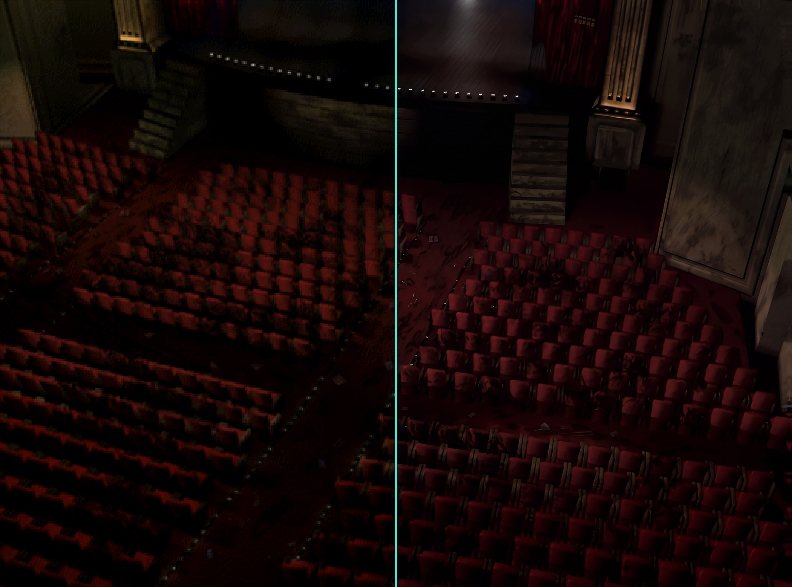
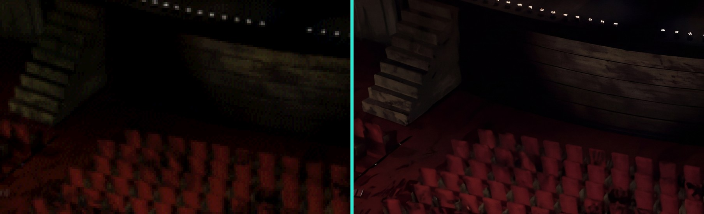

<!-- LOGO: aquí irá el logo de Parasite Eve HD Remaster (media/logo.png), como el banner de Parasite Eve II HD Remaster:

  

-->

  <b>Una versión nativa para PC de Parasite Eve, reconstruida a partir del juego original de PlayStation y remasterizada en alta definición.</b>

  
  
  

  <a href="README.md">🇬🇧 Read in English</a>

---

## Sobre el proyecto

**Parasite Eve HD Remaster** trae el RPG de terror de Square de 1998 a los PC actuales. Es el proyecto hermano de
[Parasite Eve II HD Remaster](https://github.com/faligame/Parasite-Eve-2-HD-Remaster).

**No es un emulador.** El código original del juego de PlayStation se ha recompilado estáticamente en un ejecutable
nativo de Windows, lo que permite mejorar el juego desde dentro: modelos 3D nítidos, geometría estable y fondos
prerrenderizados reconstruidos en alta resolución.

Este repositorio es la **casa pública del proyecto**: novedades, capturas y progreso. No contiene código fuente,
ejecutables ni datos del juego.

> ⭐ Dale una **estrella** y pulsa 👁️ **Watch** para seguir el desarrollo.

---

## Prueba de concepto: el primer fondo HD

El patio de butacas del Carnegie Hall, la sala donde empieza todo, es el primer fondo remasterizado. Es la **cámara
completa**, más grande que la pantalla (517×384 píxeles en el original, recorridos con desplazamiento de cámara):
reconstruida desde los datos del juego, reescalada entera con IA a 4653×3456 y devuelta pieza a pieza al juego.

   
  <b>Mitad izquierda: PS1 original · Mitad derecha: HD Remaster</b>

   
  <b>Detalle del escenario: original (izquierda) y HD (derecha)</b>

---

## Características

### 🖥️ Versión nativa para PC
- **Recompilación estática** de la edición americana (los dos discos) en un ejecutable nativo de Windows. Sin emulador.
- **Arranca con OpenBIOS**, una BIOS libre: no hace falta la BIOS de Sony.
- **Renderizado a alta resolución interna** para modelos 3D nítidos.
- **Precisión de geometría PGXP**: se acabaron los polígonos que tiemblan y las texturas que se deforman.
- **Recorte de polígonos preciso**: la PlayStation decide qué caras se ven con coordenadas enteras y, de lejos, Aya
  perdía triángulos. Ahora esa decisión se toma con precisión subpíxel y los personajes lejanos se ven completos.

### 🎨 Remasterización HD
- **Motor de texturas HD con los nombres del propio disco.** Cada imagen se reconoce al subir a la memoria de vídeo y
  se sustituye por su versión HD, que se llama como la entrada del juego (`m005_2_04.png` = sala 5, sección 2,
  imagen 4), en lugar de un código ilegible.
- **Fondos completos reconstruidos desde el disco.** En Parasite Eve los fondos no son una imagen: el juego los compone
  en pantalla con cientos de piezas de 16×16 y la cámara se desplaza por ellos, así que cada cámara tiene su propio
  tamaño (el patio de butacas del Carnegie Hall mide 517×384). El proyecto lee de los datos del juego la lista de
  piezas de cada sala y cámara y reconstruye el **fondo completo**, más grande que la pantalla, sin necesidad de jugar.
- **Reescalado del fondo entero, no de las piezas.** El fondo completo se remasteriza de una vez, con todo su contexto,
  y una herramienta devuelve cada pieza HD a su sitio exacto (comprobado píxel a píxel). No hay costuras entre piezas.
- **Primer plano incluido.** Los marcos de puerta, columnas y butacas que tapan a Aya salen de las mismas piezas del
  fondo, así que también pasan a HD y siguen tapándola igual.
- **Pensado para quien hace texturas**: volcado automático de cada textura con sus colores reales, captura de la
  cámara actual con una tecla, recarga del pack con el juego abierto y una tecla para comparar al momento con el
  original.

---

## Hoja de ruta

| Estado | Característica |
|:---:|---|
| ✅ | Ejecutable nativo de Windows (recompilación estática, edición americana, dos discos) |
| ✅ | Arranque con OpenBIOS (sin BIOS de Sony) |
| ✅ | Renderizado a alta resolución y precisión de geometría PGXP |
| ✅ | Recorte de polígonos preciso (personajes lejanos completos) |
| ✅ | Herramientas de desarrollo: panel en pantalla, pausa por fotogramas, trazas y volcados |
| ✅ | Motor de reemplazo de texturas HD con los nombres del disco |
| ✅ | Reconstrucción de los fondos completos de cada sala y cámara desde el disco |
| ✅ | Reescalado del fondo completo y reparto automático de sus piezas, primer plano incluido |
| ✅ | Primer fondo HD: patio de butacas del Carnegie Hall |
| 🚧 | Elementos animados de los fondos (luces, puertas) |
| 🚧 | Completar el pack de fondos HD |
| 🔜 | Personajes, enemigos y armas remasterizados |
| 🔜 | Cinemáticas en alta resolución |
| 🔜 | Panorámico 16:9, 60 FPS, cargas rápidas y disco único (como en Parasite Eve II HD Remaster) |
| 🔜 | Instalador que construye el juego desde tus propios discos, para no distribuir nunca datos del juego |
| 🔜 | Lanzamiento público |

---

## Novedades

**21-09-2026 — Arranca el proyecto y primer fondo HD**
- **El juego funciona como ejecutable nativo**: la edición americana (los dos discos) se recompila y ya se puede jugar
  sin emulador, arrancando con una BIOS libre.
- **Personajes lejanos completos**: el recorte de polígonos preciso que se hizo para Parasite Eve II llega también
  aquí, donde era aún más necesario.
- **Fondos reconstruidos desde el disco**: cada cámara de cada sala se compone con su tamaño real a partir de los datos
  del juego, se reescala entera y cada pieza vuelve a su sitio. El primero es el **patio de butacas del Carnegie Hall**.
- **Herramientas para el pack HD**: identificación de cada textura con su nombre del disco, volcado con sus colores
  reales, captura de cámara, recarga en caliente y comparación con el original pulsando una tecla.

---

## Preguntas frecuentes

**¿Se puede descargar?**
Todavía no. El proyecto está en desarrollo activo. Sigue este repositorio para enterarte del primer lanzamiento.

**¿Necesitaré el juego original?**
Sí. Necesitarás tu propia copia legal de *Parasite Eve* para PlayStation (edición americana). Nunca se distribuirán
datos del juego.

**¿Es un emulador?**
No. El código del juego se ejecuta de forma nativa en tu PC tras recompilarse a partir del ejecutable original de
PlayStation.

**¿Está disponible el código fuente?**
Por ahora no.

---

## Créditos

| Proyecto | Autor | Para qué se usa | Licencia |
|---|---|---|---|
| [PSXRecomp](https://github.com/mstan/psxrecomp) | Matthew Stan | El recompilador estático de PlayStation y el runtime fiel al hardware sobre el que se construye esta versión | PolyForm Noncommercial 1.0.0 |
| [Descompilación de Parasite Eve](https://github.com/khasinski/parasite-eve-decomp) | khasinski y colaboradores | Documentación de los formatos del juego (salas, fondos, texturas), símbolos y direcciones | — |
| [OpenBIOS](https://github.com/grumpycoders/pcsx-redux) | Proyecto PCSX-Redux | BIOS libre con la que arranca el juego | MIT |
| [Beetle PSX](https://github.com/libretro/beetle-psx-libretro) | libretro, basado en Mednafen | Referencia de precisión usada por PSXRecomp | GPL-2.0 |
| PGXP | iCatButler | Técnica original de precisión de geometría | — |
| [PlayStation Specifications (psx-spx)](https://psx-spx.consoledev.net/) | Martin "nocash" Korth y colaboradores | Documentación del hardware | — |

Librerías: [SDL3](https://libsdl.org), [stb_image](https://github.com/nothings/stb) (Sean Barrett),
[libchdr](https://github.com/rtissera/libchdr) y [zlib](https://zlib.net).

Pack HD Remaster y proyecto: **faligame**.

---

## Aviso legal

Este es un proyecto fan sin ánimo de lucro y no está afiliado, respaldado ni patrocinado por Square Enix.
*Parasite Eve* es una marca registrada de Square Enix Co., Ltd. Todo el contenido del juego pertenece a sus
respectivos propietarios. Este repositorio no contiene ni distribuirá nunca archivos del juego, BIOS ni recursos del
juego protegidos por derechos de autor.
